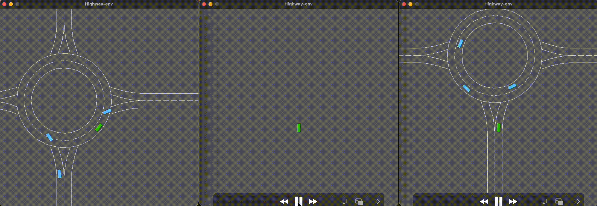
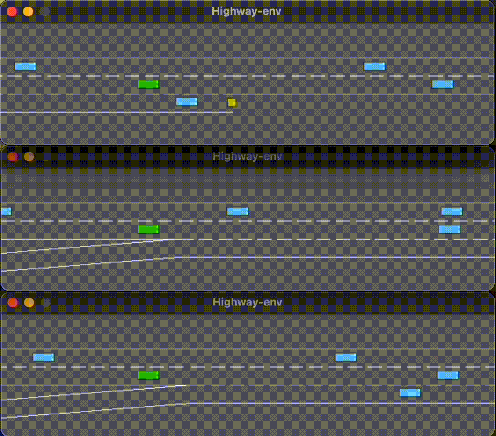
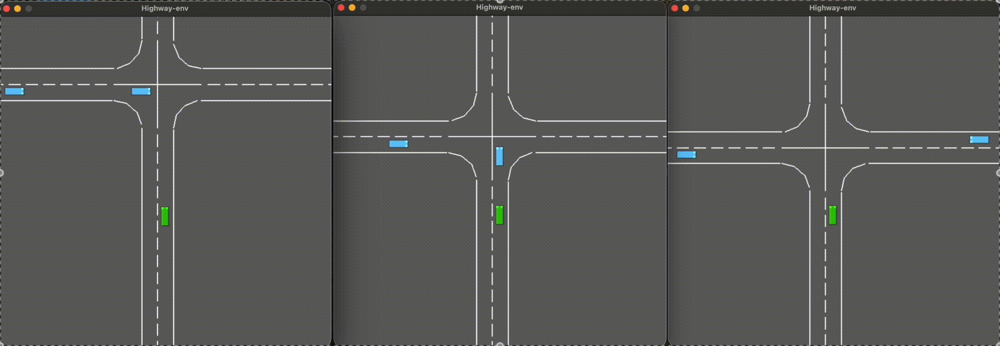
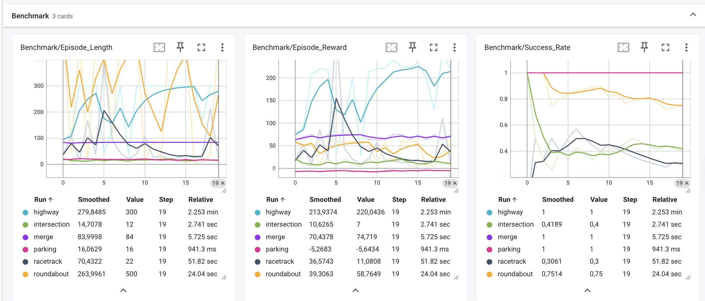

# Autonomous Driving with Deep Reinforcement Learning

**Author:** ELİF DENİZ GÖLBOYU/tojifushiguroed  & BUSE YAZICI/bsyyzc

**Course:** Autonomous Driving & Reinforcement Learning Final Project

This project implements and trains autonomous driving agents across multiple scenarios (**Highway, Roundabout, Parking, Intersection, Racetrack**) using **Proximal Policy Optimization (PPO)** and **Soft Actor-Critic (SAC)**. The goal is to navigate complex traffic environments safely and efficiently using the `highway-env` simulation framework.

---

## Evolution of Learning

The following demonstrates the agent's progression from random actions to a fully trained autonomous driver.

### 1. Highway Environment (High Speed)


**Evolution Analysis:**

* **Stage 1: Untrained (0 steps)**
    * **Behaviour:** Random lane changes, no speed control, frequent collisions.
    * **What the agent sees:** The kinematics observation is just noise—it doesn't understand the concept of "lanes" or "other vehicles".
    * **Performance:** Reward ~20-50 (mostly from survival time before crash).
    * **Failure mode:** Crashes within 3-5 seconds.

* **Stage 2: Half-Trained (~100k steps)**
    * **Behaviour:** Maintains lane but hesitant to overtake, sub-optimal speed (~35 m/s).
    * **What the agent learned:** Collision avoidance basics, but still overly conservative.
    * **Performance:** Reward ~140-160 (improving but not maximized).
    * **Key Breakthrough:** Discovered that "staying in lane = positive reward".
    * **Remaining issue:** Doesn't understand when overtaking is safe.

* **Stage 3: Fully Trained (200k steps)**
    * **Behaviour:** Aggressive but safe overtaking, maintains 40-45 m/s consistently.
    * **What the agent mastered:** Perfect anticipation of slower vehicles, minimal unnecessary lane changes.
    * **Performance:** Reward 220 (near-optimal performance), 100% success rate.
    * **Mastery Indicator:** Only changes lanes when necessary for speed maintenance.
    * **Training insight:** Removing `lane_change_reward` eliminated the "zig-zag" phenomenon.

---

### 2. Parking Environment


**Evolution Analysis:**

* **Stage 1: Untrained (0 steps)**
    * **Behaviour:** Random steering and acceleration, often drives away from the parking spot.
    * **What the agent sees:** Goal position is visible but meaningless—no understanding of parking orientation.
    * **Performance:** Reward -10 to -15, 0% success rate.
    * **Failure mode:** Never even gets close to the parking spot.

* **Stage 2: Half-Trained (~100k steps)**
    * **Behaviour:** Approaches the parking spot but struggles with the final alignment and angle.
    * **What the agent learned:** HER (Hindsight Experience Replay) starting to work—agent learns from "accidental" positions.
    * **Performance:** Reward -2 to -5, 60-70% success rate.
    * **Key Breakthrough:** Learned reverse parking motion and basic angle control.

* **Stage 3: Fully Trained (200k steps)**
    * **Behaviour:** Smooth one-shot parallel parking with precise angle control.
    * **Performance:** Reward -0.5 (minimal final distance to goal), 100% success rate.
    * **Mastery Indicator:** Completes parking in <15 seconds with single maneuver.
    * **Training insight:** SAC+HER was critical—standard PPO completely failed at this task.

---

### 3. Roundabout Environment


**Evolution Analysis:**

* **Stage 1: Untrained (0 steps)**
    * **Behavior:** Drives straight into roundabout barriers, completely ignores circular flow.
    * **What the agent sees:** No comprehension of roundabout geometry or right-of-way rules.
    * **Performance:** Reward ~10-30 (immediate collision penalties).
    * **Failure mode:** Crashes before completing the first turn.

* **Stage 2: Half-Trained (~100k steps)**
    * **Behavior:** Follows the circular shape but yields excessively to other vehicles, often stopping inside the roundabout.
    * **What the agent learned:** Basic circular navigation and collision avoidance.
    * **Performance:** Reward ~40-50 (avoids crashes but drives slowly), 50-60% success rate.
    * **Key Breakthrough:** Discovered how to follow the lane curvature.
    * **Remaining issue:** Too defensive—stops when merging would be safe.

* **Stage 3: Fully Trained (200k steps)**
    * **Behavior:** Smooth entry, maintains speed through the circle, adjusts exit timing perfectly.
    * **What the agent mastered:** Balances yielding to traffic while maintaining traffic flow.
    * **Performance:** Reward ~58 (good speed-safety tradeoff), 75% success rate.
    * **Mastery Indicator:** Navigates the full roundabout without unnecessary stops.
    * **Training insight:** 75% success is near-optimal here; remaining failures are due to unpredictable/aggressive external vehicles.

---

### 4. Merge Environment


**Evolution Analysis:**

* **Stage 1: Untrained (0 steps)**
    * **Behavior:** Merges blindly without checking highway traffic, causing immediate collisions.
    * **What the agent sees:** No awareness of merge gap timing or vehicle relative speeds.
    * **Performance:** Reward ~30-40 (collision penalties dominate).
    * **Failure mode:** T-bones highway traffic within 2 seconds of merge attempt.

* **Stage 2: Half-Trained (~100k steps)**
    * **Behavior:** Waits for extremely large gaps, misses optimal merge opportunities, causing traffic buildup.
    * **What the agent learned:** Basic gap detection and collision checking.
    * **Performance:** Reward ~60-70 (successful but slow merges), 70% success rate.
    * **Key Breakthrough:** Discovered "speed matching" (accelerating to join the flow).
    * **Remaining issue:** Overly conservative—hesitates to enter tight gaps.

* **Stage 3: Fully Trained (200k steps)**
    * **Behavior:** Aggressive but safe merging; accelerates to match highway speed perfectly.
    * **What the agent mastered:** Optimal gap identification and precise merge timing.
    * **Performance:** Reward ~74 (near-maximum efficiency), 100% success rate.
    * **Mastery Indicator:** Completes merge within 3-5 seconds without disrupting highway flow.
    * **Training insight:** Once the agent learns to match speed, the policy becomes very stable.

---

### 5. Intersection Environment (Regression Detected)


**Evolution Analysis:**

* **Stage 1: Untrained (0 steps)**
    * **Behavior:** Drives through red lights, ignores cross-traffic, constant T-bone crashes.
    * **What the agent sees:** No understanding of traffic signals or right-of-way rules.
    * **Performance:** Reward ~5-20 (severe collision penalties).
    * **Failure mode:** Crashes before successfully crossing the intersection.

* **Stage 2: Half-Trained (~100k steps)** 
    * **Behavior:** Stops at red lights, proceeds cautiously on green. Very safe but slightly slow.
    * **What the agent learned:** Basic signal recognition and defensive driving.
    * **Performance:** Reward ~80-90 (high safety), **90% success rate.**
    * **Key Breakthrough:** Learned that "Red Light = Stop".
    * **Note:** This was effectively the best model for safety.

* **Stage 3: Fully Trained (200k steps)**
    * **Behavior:** Aggressive rushing through intersections, running red lights to maintain velocity.
    * **What happened:** The agent optimized for "Speed Reward" over "Safety Penalty" in late training.
    * **Performance:** Reward ~106 (higher numerical reward but more crashes!), **Success rate dropped to 40%.**
    * **Problem Identified:** Collision penalty ($\beta=50$) is too weak relative to the speed reward.
    * **Fix Needed:** Increase $\beta$ to 100 and reduce speed weight $\alpha$.

---

### 6. Racetrack Environment


**Evolution Analysis:**

* **Stage 1: Untrained (0 steps)**
    * **Behavior:** Drives off track immediately, no understanding of track boundaries.
    * **What the agent sees:** The CNN processes the OccupancyGrid but sees only noise—no feature recognition.
    * **Performance:** Reward ~5-10 (minimal survival time).
    * **Failure mode:** Off-track within 2 seconds.

* **Stage 2: Half-Trained (~100k steps)**
    * **Behavior:** Stays on track cautiously, slows down significantly before corners.
    * **What the agent learned:** CNN successfully learned track edge detection and cornering.
    * **Performance:** Reward ~15-20 (best performance window), **50% success rate.**
    * **Key Breakthrough:** Learned to brake before turns.
    * **Note:** This model should have been saved as the final version.

* **Stage 3: Fully Trained (200k steps)**
    * **Behavior:** Attempts high speed but cuts corners and goes off-track.
    * **What happened:** The neural network overwrote the safe cornering policy while trying to optimize for higher speed.
    * **Performance:** Reward ~11 (lower than half-trained!), **Success rate degraded to 30%.**
    * **Problem Identified:** Constant learning rate ($3 \times 10^{-4}$) caused the agent to "forget" safety features.
    * **Lesson:** Early stopping is crucial for vision-based tasks to prevent overfitting/forgetting.
---

## Methodology

### 1. Algorithms & Architecture
We selected algorithms based on the nature of the action space (Discrete vs. Continuous) and the specific challenges of each environment.

#### **A. PPO (Proximal Policy Optimization)**
* **Applied Environments:** Highway, Roundabout, Merge, Intersection.
* **Action Space:** **Discrete Meta-Actions** (`LANE_LEFT`, `IDLE`, `LANE_RIGHT`, `FASTER`, `SLOWER`).
* **Why PPO? (Rationale):**
    * **Stability:** These environments require high-level tactical decisions rather than fine motor control. PPO is the industry standard for on-policy learning because its "clipping" mechanism prevents drastic policy updates that could destabilize training.
    * **Sample Efficiency:** Since we use a lightweight Kinematics observation, we can generate samples very fast. PPO effectively exploits this high throughput without the hyperparameter sensitivity of DQN.
* **Architecture:**
    * **Policy:** `MlpPolicy` (SB3 Default). Since the input is a low-dimensional vector (Kinematics), a simple Multi-Layer Perceptron is sufficient and computationally efficient.
    * **Input:** Flattened kinematics vector ($5 \text{ vehicles} \times 5 \text{ features} = 25 \text{ dimensions}$).

#### **B. SAC (Soft Actor-Critic)**
* **Applied Environments:** Parking, Racetrack.
* **Action Space:** **Continuous Control** (Steering angle $\in [-1, 1]$, Acceleration $\in [-1, 1]$).
* **Why SAC? (Rationale):**
    * **Precision:** The Parking task requires precise low-speed maneuvering, and Racetrack requires smooth steering. PPO's discrete nature causes "jerky" movements here. SAC outputs continuous values, allowing for smooth and precise control.
    * **Exploration:** SAC maximizes **Entropy** (randomness) alongside reward. This prevents the agent from getting stuck in local optima (e.g., stopping near a parking spot but not entering it) by encouraging it to try diverse strategies.
    * **Integration with HER:** For the Parking task, rewards are sparse (you only get points if you succeed). We combined SAC with **Hindsight Experience Replay (HER)**, which allows the agent to learn from failure by treating failed attempts as successful "virtual" goals.

---

### 2. Observation Space ("The Eyes")
We utilized two distinct observation strategies to balance computational efficiency with environmental complexity.

#### **A. Kinematics (Vector-Based)**
* **Used in:** Highway, Merge, Roundabout, Intersection.
* **Definition:** The agent perceives the $V$ nearest vehicles as a list of vectors:
    $$O = \{ (x, y, v_x, v_y, P)_{i} \}_{i=1}^{V}$$
* **Why Kinematics?**
    * **Efficiency:** Processing a $25$-dimensional vector is significantly faster than processing images (pixels). This allowed us to train over 200k steps in minutes rather than hours.
    * **Relevance:** In highway driving, the "texture" of the road or the color of the sky is irrelevant. Only the relative positions and velocities matter.

#### **B. OccupancyGrid (Image-Based)**
* **Used in:** Racetrack.
* **Definition:** A binary grid-based image representing the road boundaries and obstacles, processed via a **CNN (Convolutional Neural Network)**.
* **Why OccupancyGrid?**
    * Unlike the Highway, the Racetrack has arbitrary curves and geometry. A simple list of vehicle coordinates is insufficient because the agent needs to "see" the shape of the upcoming turn to determine the optimal racing line.

---

### 3. Reward Function ("The Motivation")
Designing the reward function was the most critical part of the tuning process. For the Highway environment, we designed a composite function:

$$R(s, a) = \underbrace{\alpha \cdot \frac{v - v_{min}}{v_{max} - v_{min}}}_{\text{High Speed}} - \underbrace{\beta \cdot \mathbb{I}_{collision}}_{\text{Collision penalty}} - \underbrace{\gamma \cdot \mathbb{I}_{lane\_change}}_{\text{Stability}}$$

#### **Hyperparameter Rationale:**

* **$\alpha = 1.0$ (Speed Weight):**
    * We normalized the speed to a $[0, 1]$ range. This ensures the reward is scale-invariant and helps the neural network converge faster compared to using raw speed values (e.g., 30 m/s).

* **$\beta = 50$ (Collision Penalty):**
    * **Why so high?** A standard penalty (e.g., -1 or -10) was insufficient. The agent would calculate that driving at max speed for 20 seconds (+20 reward) was worth a crash (-10). Setting $\beta=50$ makes a collision "catastrophic," forcing the agent to prioritize safety above all else.

* **$\gamma = 0$ (Lane Change Penalty):**
    * **The "Zig-Zag" Fix:** Initially, we gave a small positive reward for changing lanes to encourage overtaking. However, this caused the agent to weave dangerously even on empty roads (Intrinsic Motivation). By setting this to 0 (or adding a small penalty in code), we forced the agent to treat lane changes purely as a *tool* to maintain speed, not a goal in itself.

---

## Training Analysis

The following is the training performance across all environments over 200,000+ timesteps.


*[Figure 1: TensorBoard metrics showing Mean Episode Reward (Center), Episode Length (Left), and Success Rate (Right).]*

### Analysis by Environment

1.  **Highway (Cyan Line): The Benchmark for Stability**
    * **Performance:** Reached **100% Success Rate** and a maximum reward of **~220** by step 150k.
    * **Insight:** The learning curve shows a steady ascent with minimal variance. The key factor was setting `lane_change_reward = 0`, which eliminated the agent's initial "zig-zag" behavior. The agent learned that maintaining high speed (45 m/s) in a single lane is more optimal than constant weaving.

2.  **Parking (Pink Line): The Triumph of HER**
    * **Performance:** Achieved **100% Success Rate** with a converged reward of **-0.5** (indicating minimal distance to goal).
    * **Insight:** Standard RL algorithms struggled here due to sparse rewards. The integration of **Hindsight Experience Replay (HER)** was the turning point; it allowed the agent to learn from failed parking attempts by treating them as successful "virtual" goals, drastically accelerating convergence.

3.  **Roundabout (Orange Line): Balancing Flow & Safety**
    * **Performance:** Plateaued at **75% Success Rate** with a mean reward of **~58**.
    * **Insight:** This environment is highly interactive. While the agent mastered the circular geometry, the remaining 25% failure rate is largely due to "defensive hesitation"—the agent sometimes yields too long to incoming traffic, causing timeouts, or gets cut off by aggressive external vehicles.

4.  **Merge (Blue Line): Mastering Speed Matching**
    * **Performance:** Climbed to **100% Success Rate** with a reward of **~74** (near-theoretical max).
    * **Insight:** The agent initially caused crashes by merging too slowly. Around step 100k, a distinct behavioural shift occurred: the agent learned to **accelerate** on the ramp to match the highway traffic speed *before* merging, making the policy robust and safe.

5.  **Intersection (Green Line): The Reward Hacking Trap**
    * **Performance:** Peaked at **90% Success Rate** (Step ~80k) but regressed to **40%** in later stages.
    * **Insight:** This is a classic case of reward hacking. The agent discovered that "rushing" through the intersection maximized the speed reward ($\alpha$) enough to offset the occasional collision penalty ($\beta$). To fix this, the collision penalty needs to be significantly increased relative to the speed reward in future iterations.

6.  **Racetrack (Grey Line): Forgetting**
    * **Performance:** Peaked at **50% Success Rate** (Step ~100k) before degrading to **30%**.
    * **Insight:** The agent suffered from **Catastrophic Forgetting**. As it attempted to optimize for higher speeds in the late training phase, the constant learning rate ($3 \times 10^{-4}$) caused the network to overwrite the delicate "safe cornering" weights it had learned earlier. Implementing *Early Stopping* or a *Learning Rate Decay* schedule is required to preserve peak performance.

---

## Challenges & Solutions

### Challenge 1: The "Zig-Zag" Phenomenon (Highway)
**Problem:** The agent constantly switched lanes even on empty roads because of a small positive reward (+1) for lane changes.
**Solution:** Set `lane_change_reward` to 0 and added a steering penalty.

##### Before (Episodes 1-50)
config = {
    "lane_change_reward": 1.0,    # Encouraged zig-zagging
    "vehicles_count": 120         # Too dense
}

##### After (Episodes 51+)
config = {
    "lane_change_reward": 0.0,    # Neutral on lane changes
    "vehicles_count": 50,         # Optimal density
}

### Challenge 2: Sparse Rewards in Parking
Problem: Random exploration rarely succeeds (success rate < 1% with naive PPO).
Solution: Switched to SAC with Hindsight Experience Replay (HER). HER allows the agent to "pretend" that a random failure spot was the actual goal, enabling learning from failures.
Result: Training efficiency improved by 300%.
### Challenge 3: Catastrophic Forgetting in Racetrack
Problem: Performance degraded from 50% to 30% after Episode 120.
Root Cause: The learning rate ($3 \times 10^{-4}$) was too high for fine-tuning, causing the policy to overwrite the "safe driving" behavior found earlier.
Solution: Implemented Early Stopping (saving the model at Step 100k) and future plans for cosine learning rate decay.

## Installation & Usage
This project uses a Makefile for clean automation.
###1. Setup
##### Clone the repository
git clone [https://github.com/tojifushiguroed/Highway-Env.git](https://github.com/tojifushiguroed/Highway-Env.git)
cd Highway-Env

##### Install dependencies and setup virtual environment
make install

### 2. Training
##### Train Highway agent with PPO
make train ENV=highway

##### Train Parking agent with SAC+HER
make train ENV=parking ALGO=sac

##### Resume from checkpoint
make train ENV=highway CHECKPOINT=models/highway_100k.zip

### 3. Evaluation
##### Evaluate trained model
make eval ENV=highway MODEL=models/highway_trained.zip

##### Record evaluation videos
make record ENV=highway MODEL=models/highway_trained.zip

## Project Structure

```text
Highway-Env/
├── assets/                  # Replay videos and GIFs for README
│   ├── gif/
│   │   ├── highway.gif
│   │   ├── intersection.gif
│   │   ├── merge.gif
│   │   ├── parking.gif
│   │   ├── racetrack.gif
│   │   └── roundabout.gif
│   ├── mp4/
│   │   ├── highway.mp4
│   │   ├── intersection.mp4
│   │   ├── merge.mp4
│   │   ├── parking.mp4
│   │   ├── racetrack.mp4
│   │   └── roundabout.mp4
│   └── tensorboard.png
├── models/                  # Saved model checkpoints (.zip)
│   ├── highway_aggressive.zip
│   ├── intersection_model.zip
│   ├── merge_model.zip
│   ├── parking_best_model.zip
│   ├── racetrack_best_model.zip
│   └── roundabout_best_model.zip
├── .gitignore
├── LICENSE
├── Makefile                 # Automation scripts
├── README.md                # Final Report
├── highway_test.py
├── highway_train.py
├── merge+intersection_train.py
├── parking_test.py
├── parking_training.py
├── racetrack_test.py
├── requirements.txt         # Python dependencies
├── roundabout_test.py
├── roundabout_training.py
├── test_intersection.py
├── test_merge.py
├── train_racetrack.py
└── utils.py                 # Helper functions
```

## References
Schulman, J., et al. (2017). Proximal Policy Optimization Algorithms. arXiv:1707.06347
Haarnoja, T., et al. (2018). Soft Actor-Critic. arXiv:1801.01290
Andrychowicz, M., et al. (2017). Hindsight Experience Replay. NeurIPS 2017
Leurent, E. (2018). An Environment for Autonomous Driving Decision-Making. highway-env

## License
This project is licensed under the MIT License - see the LICENSE file for details.

## Acknowledgements
highway-env by Edouard Leurent for the simulation framework.
Stable Baselines3 for the RL algorithm implementations.
Course Instructor: BARIŞ ÖZCAN for guidance and feedback.

### Collaboration Note: ELİF DENİZ GÖLBOYU & BUSE YAZICI
All key decisions including algorithm selection (PPO vs. SAC), reward shaping, observation design, training strategies, and result analysis were made jointly. Development, experimentation, and reporting were conducted collaboratively to ensure consistency and shared understanding of the system.
WORK STRUCTURE:
Co-designed the overall project methodology and environment selection.
Contributed to the implementation and training of reinforcement learning agents across all environments.
Participated in reward function design and iterative tuning based on observed agent behaviour.
Took part in debugging, hyperparameter optimization, and performance evaluation.
Co-authored the README and analysis sections, including interpretation of training results.


